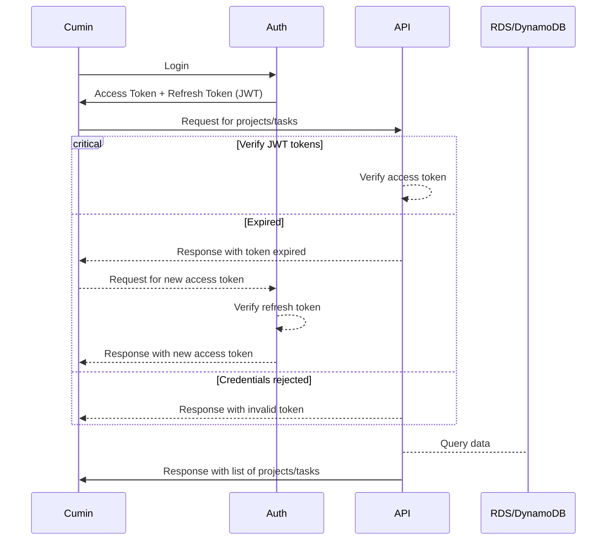
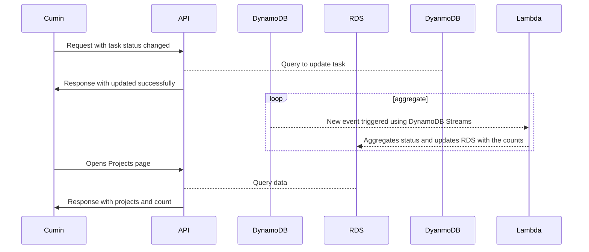
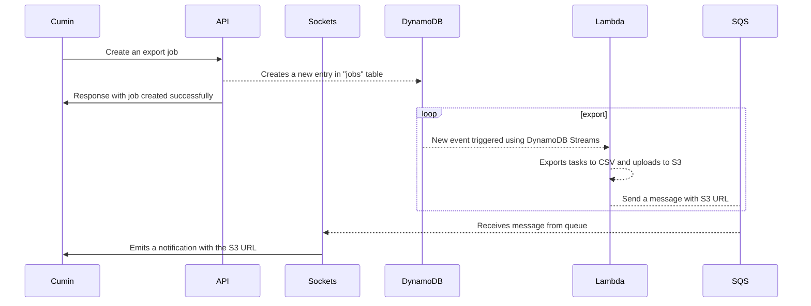

# Cumin

Cumin is a **scalable and secure** task management tool designed to handle tasks efficiently at any scale. Built with a **microservices architecture**, it ensures seamless performance while keeping security at its core.

**🔥 Features at a Glance**
- **Authentication & Security** – JWT-based authentication for secure user access.
- **Microservice Architecture** – A robust Node.js backend, orchestrated with NGINX as a reverse proxy.
- **Real-time Notifications** – Stay updated with WebSockets-powered alerts using Sockets.io .

**☁️ AWS-Powered Infrastructure**
Cumin takes full advantage of AWS services for reliability and performance:

- **Databases** – Amazon RDS (PostgreSQL) & Amazon DynamoDB for structured and NoSQL storage.
- **Messaging & Queues** – Amazon SQS handles asynchronous task processing like a pro.
- **Serverless Processing** – AWS Lambda executes background tasks with efficiency.
- **Storage** – Amazon S3 keeps your files safe and accessible.

More features coming soon! Stay tuned for updates 👉 [anikeshk.com/project/cumin](https://anikeshk.com/project/cumin/)

Reach out to Anikesh for questions or to discuss this project: anikesh.kamath@gmail.com .

## Sequence Diagrams

**1. Standard Auth and API Flow**

This is the standard API Request/Response flow when an user uses Cumin. 

- The access token has an expiry of 15 mins, and the refresh token has an expiry of 7 days.
- The same flow is applicable to adding projects/tasks, updating tasks, and creating a new export job.

**2. Tasks Aggregator**

This is what happens when the user updates the status of any task.

**3. Tasks Exporter**

This is what happens when the user creates an export job for any project.

